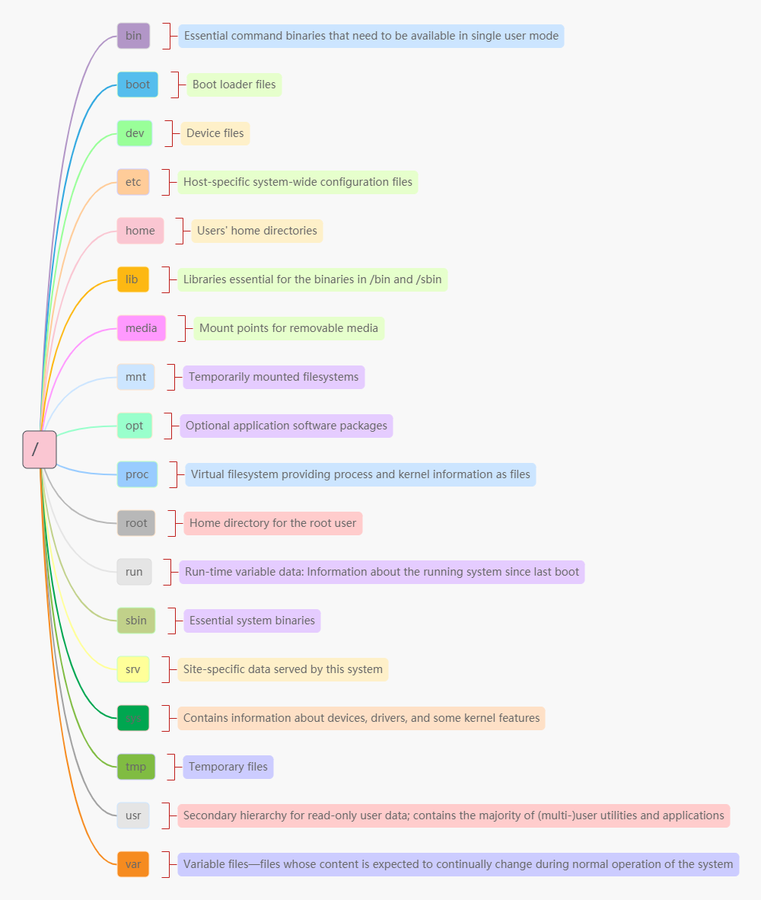

`/` (Primary hierarchy root and root directory of the entire file system hierarchy)

* `bin` (Essential command binaries that need to be available in single user mode)
* `boot` (Boot loader files)
* `dev` (Device files)
* `etc` (Host-specific system-wide configuration files)
* `home` (Users' home directories)
* `lib` (Libraries essential for the binaries in `/bin` and `/sbin`)
* `media` (Mount points for removable media)
* `mnt` (Temporarily mounted filesystems)
* `opt` (Optional application software packages)
* `proc` (Virtual filesystem providing process and kernel information as files)
* `root` (Home directory for the root user)
* `run` (Run-time variable data: Information about the running system since last boot)
* `sbin` (Essential system binaries)
* `srv` (Site-specific data served by this system)
* `sys` (Contains information about devices, drivers, and some kernel features)
* `tmp` (Temporary files)
* `usr` (Secondary hierarchy for read-only user data; contains the majority of (multi-)user utilities and applications)
* `var` (Variable files—files whose content is expected to continually change during normal operation of the system)